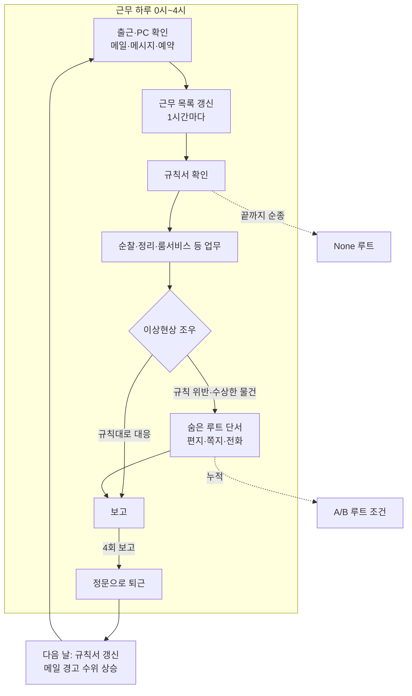

# 역기획서: NOMANUAL 1 근무 사이클과 "결말이 정해진 비극" 서사

> - 대상: NOMANUAL (RIPLEY Studio, 2025) / 비교: Mouthwashing(Wrong Organ, 2024), Iron Lung(David Szymanski, 2022), What Remains of Edith Finch(Giant Sparrow, 2017)
> - 조사 범위: NOMANUAL 1의 하루 근무 사이클·규칙서·메일 단계 상승·루트 분기, 그리고 결말이 고정된 서사를 플레이어가 받아들이게 하는 장치. 전투·수치 밸런스 제외
> - 형식: 요약 + NOMANUAL 0 이식 관점 / 작성일 2026-09-16 / 지휘실 세션 작성
> - 주요 출처: `../02_세계관/NOMANUAL1_시나리오_정리.md`(출시본 대사 테이블 기반, A등급), Steam 스토어 페이지, 영문 위키백과(Mouthwashing·Iron Lung·Edith Finch), Intermittent Mechanism 블로그(Mouthwashing 플래시백 분석)
> - 표기: 무표기 = 1차 자료 또는 2곳 이상 일치, `[추정]` = 1곳만 확인. 설계 의도 해석은 작성자 추론
> - 함께 읽기: `레퍼런스_유사작_지형도.md`(roosevelt-98), `역기획서_날짜사이클_꿈현실순환.md`(roosevelt-bf)

## 1. 한 줄 정의

NOMANUAL 1은 **"규칙을 지키면 안전하다"는 약속을 매일 조금씩 무너뜨리는 5일짜리 야간 근무 시뮬레이터**다. 근무 목록과 규칙서가 행동을 정해 주고, 메일·메시지가 그 규칙을 준 회사를 의심하게 만들며, 규칙을 어기는 행동이 곧 다른 엔딩으로 가는 문이다.

비교작 셋은 모두 **플레이어가 결말을 바꿀 수 없다는 사실을 오히려 무기로 쓴다.** NOMANUAL 0은 엔딩이 1종(배드엔딩)이고 "무엇을 해도 의식은 성공한다"가 설정이므로, 1편의 근무 사이클 문법과 이 셋의 "정해진 비극" 문법을 섞어야 한다.

## 2. NOMANUAL 1 코어 루프

## 3. 구조 분해

**하루의 틀: 4시간·4보고.** 근무는 0시~4시이고 근무 목록은 1시간마다 바뀌며, 3시 이후 순찰이 붙고 4번 보고하면 정문으로 퇴근한다. 하루 안에 "목록 받기 → 처리 → 보고"가 네 번 돌므로, 플레이어는 5일 동안 같은 박자를 약 20번 반복한다. 박자가 고정돼 있으니 **어긋남이 곧 공포 신호**가 된다. 매일 같던 3시 순찰에 R.S가 "3시를 기다려주시기 바랍니다"라는 메시지를 겹치는 4일차가 그 예다. 반복을 지루함이 아니라 기준선으로 쓰는 설계다.

**도구 네 개가 정보 채널을 나눈다.** 업무용 PC(메일·메시지·예약·상점·보고서), 규칙서, 근무 목록 수첩, 손전등. 채널마다 말하는 주체가 다르다.

| 채널 | 말하는 쪽 | 신뢰도 흐름 |
|---|---|---|
| 규칙서 | R.S(공식) | "유일한 안전 수단" → 끝에서 "전부 거짓말"(None 결말 독백) |
| 근무 목록 | R.S(업무) | 끝까지 중립적. 일상의 뼈대 |
| 메일·메시지 | R.S + 검열된 외부인 + 발신자 제한 | 날마다 경고와 검열이 늘어남 |
| 쪽지·전화·편지 | 루즈벨트, 미상 조력자 | 규칙 위반으로만 닿음 |

공식 채널과 비공식 채널이 서로 반박하게 두어, 플레이어가 "누구 말을 믿을지"를 스스로 고르게 만든다. 전투가 없는 게임에서 선택의 긴장을 만드는 거의 유일한 축이다.

**규칙서: 안전의 약속이 곧 함정.** 규칙서는 이상현상 대처법과 근무 방법만 담고 배경은 일절 없다(나폴리탄 괴담 형식). 1일차 공지는 규칙서를 "안전을 보장하는 유일한 수단"이라 부르고, None 루트 독백은 "규칙서대로면 불안은 사라졌다"에서 지하실 심연으로 걸어 들어가는 것으로 끝난다. 규칙을 **완벽히 지킨 보상이 최악의 결말**이라는 역전이다. 플레이어가 게임에게 기대하는 "지시를 따르면 이긴다"를 그대로 뒤집어, 두 번째 플레이에서 규칙을 어기게 만드는 동기로 쓴다.

**메일 수위는 날짜로 올라간다.**

| 날 | R.S 공식 메시지 | 비공식 신호 |
|---|---|---|
| 0 | "당신은 안전할 것입니다" / 인수인계 영상 `<손상된.mp4>` | 부작용 목록 일부 검열 |
| 1 | 외부 연락 필터링, 규칙서가 유일한 수단 | 썩은 고기 자루, 예약 누락, 가려운 투숙객 |
| 2 | 정신 착란 동반 이상현상 다수 | 항우울제 임상(배포 중지), 검은 우산 실종자 |
| 3 | 심각한 위험 | 상담 채널 "당신들은 미쳤어" → "지금까지 일해주셔서 감사했습니다" → 검열 |
| 4 | "지하실은 아늑한 곳… 3시를 기다려주십시오" | 매크로 메일 "그들의 말을 믿지 - (검열됨)" |
| 5 | "어제 메일은 신경쓰지 마시길… 매우 안전한 날" | — |

공간(호텔)은 날마다 거의 같지만 **텍스트가 먼저 무너진다.** 맵을 새로 만들지 않고 메일 몇 통으로 날짜의 체감 차이를 만드는, 소규모 팀에 맞는 비용 구조다. 5일차의 "안전한 날"은 수위를 갑자기 내려서 오히려 가장 위협적으로 들리게 한다.

**루트 분기: 위반이 곧 열쇠.** A 루트는 "201호 앞 편지는 무시하라"는 수칙을 어기고 편지를 줍는 데서 시작하고, B 루트는 첫날 얻은 기름과 사무실 책상에서 눈을 감는 행동에 걸린다. 분기 조건이 대화 선택지가 아니라 **공간 속 물건과 금지 행동**에 있다. 플레이어는 분기점을 알아채지 못한 채 지나가기 쉽고, 엔딩을 본 뒤 "그 편지였구나"를 역산하게 된다. 재플레이 동기를 만드는 대신, 한 번만 하는 플레이어는 None 엔딩만 볼 위험이 크다.

**시간 되감기: 반복을 서사 안에 넣는다.** A 루트 끝에서 루즈벨트가 플레이어를 "첫날 새벽 세 시"로 돌려보내고, B 루트의 미상 발신자는 "그는 수많은 시간을 되돌렸다… 당신은 마지막 차례"라고 말한다. 게임을 다시 시작하는 행위 자체를 **루즈벨트가 반복해 온 실패한 순환**으로 규정한 것이다. 메타 반복을 설정으로 흡수해 회차 플레이의 어색함을 없앤다. 동시에 이것이 NOMANUAL 0이 설명해야 할 빚이기도 하다(7장).

## 4. "결말이 정해진 비극" 레퍼런스

| | 결말을 언제 알려주나 | 플레이어의 역할 | 저항감을 없애는 장치 | 분량·가격 |
|---|---|---|---|---|
| Mouthwashing | 첫 장면(선장이 소행성에 충돌) | 이미 벌어진 일을 되짚고, 그 과정에 손을 보탬 | 3개 시간대를 감정의 전환점에서 교차 | 2~3시간 `[추정]` |
| Iron Lung | 결말까지 숨김. 사후 텍스트로 임무 자체가 무의미했다고 밝힘 | 명령받은 사진 촬영 | 극도로 좁은 조작·시야, 짧은 길이 | 1~2시간 `[추정]`, $6→$8(2023) |
| Edith Finch | 시작부터 가족이 다 죽었다는 걸 앎 | 각자의 마지막 순간을 직접 조작 | 인물마다 다른 조작 문법, 마술적 사실주의 | 2시간 내외 `[추정]` |
| NOMANUAL 1 | 숨김. None 엔딩에서 "선택권이 있었던 것 같다" | 규칙을 따르거나 어김 | 시간 되감기로 재도전을 설정화 | 5일 구조, ₩13,500 |

**Mouthwashing: 결말을 먼저 보여 주고, 손을 더럽히게 한다.** 게임은 선장 컬리가 배를 소행성으로 모는 장면으로 열리고, 플레이어는 경고를 무시한 채 오른쪽으로 조종해야 한다. 이후 충돌 전 6일, 충돌 후 2개월, 4개월을 감정이 꺾이는 지점마다 오간다. 대표 장면은 소독용 알코올이다. 한때 자유롭게 집을 수 있던 물건이, 미래 장면에서 지미가 스완지에게 넘긴 것으로 드러나고, 시간대가 따라잡으면 플레이어가 직접 건네야 진행된다. 결말이 이미 알려져 있으므로 긴장은 "무슨 일이 일어날까"에서 **"내가 어떻게 거기에 손을 보태게 될까"**로 옮겨 간다. Metacritic 88, OpenCritic 추천 92%, 로우폴리 그래픽 뒤의 아트 디렉션이 호평받았다(위키백과). 행위자성을 빼앗는 것이 불만이 아니라 주제가 된 사례다.

**Iron Lung: 결말을 숨기고, 성공 자체를 무효로 만든다.** 창 없는 잠수정에서 흐린 사진과 불완전한 지도로 좌표를 찾아 사진을 찍는 것이 전부다. 마지막에 괴물이 선체를 부수고 플레이어는 죽고, 이어지는 텍스트가 그 사진들은 회수조차 되지 않는다고 알려 준다. 플레이 내내 쌓은 "임무 달성"이 마지막 몇 줄로 무의미해진다. 정보 채널을 극단적으로 좁혀서(사진 한 장, 좌표 몇 개) 짧은 분량 안에 집중을 붙들고, 반전 비용은 텍스트 몇 줄로 끝낸다. 1인 개발·Unity라는 점에서 Roosevelt 규모와 가장 가깝다.

**Edith Finch: 결말은 전제이고, 과정이 콘텐츠다.** 집 안을 돌며 가족 한 명씩의 마지막 순간을 플레이한다. 죽음은 미리 알려져 있으므로 조작 방식(아이의 상상, 통조림 공장의 손 등, 인물마다 다름)이 매번 새로운 볼거리가 된다. 결말이 고정되면 플레이어는 **"어떻게"에 주의를 쏟는다.** 집이 증축을 거듭한 형태로 가족사를 공간에 새긴 것도, 날짜마다 변하는 공간을 쓰려는 Roosevelt에 참고가 된다.

## 5. 설계 의도 종합

- **순종을 벌한다.** NOMANUAL 1과 Iron Lung은 지시를 끝까지 따른 결과가 파멸이다. 게임이 늘 주던 "지시=안전" 계약을 깨는 것이 공포의 핵심이다
- **결말이 고정되면 질문이 바뀐다.** Mouthwashing·Edith Finch는 "어떻게 될까" 대신 "어떻게 거기까지 갔나", "나는 무엇을 보탰나"를 묻는다
- **반복을 설정으로 삼는다.** NOMANUAL 1의 시간 되감기는 회차 플레이를 루즈벨트의 순환으로 만든다
- **싼 수단으로 날짜 차이를 만든다.** 메일·쪽지 텍스트, 같은 공간의 작은 변화. 맵 추가보다 싸다

## 6. 한계와 대가

- **숨은 분기의 발견성.** NOMANUAL 1은 분기 조건이 금지 행동에 숨어 있어, 한 번만 하는 플레이어는 None 엔딩만 보고 세계관 대부분을 놓친다. Steam 리뷰 수는 조회 시점에 6건으로 점수가 표시되지 않았다 `[추정: 지역·언어 필터 영향 가능]`
- **행위자성 박탈의 피로.** Mouthwashing의 강제 행동은 주제와 맞물려야만 성립한다. 이유 없이 막으면 그냥 조작 불가로 느껴진다
- **반전 한 방 의존.** Iron Lung식 사후 텍스트 반전은 짧은 분량에서만 버틴다. 6일 구조에서 마지막 한 방에만 기대면 1~4일차가 늘어진다
- **스토어 설명과 실제의 간극.** Steam 설명은 "정신력·스태미나", 인벤토리를 내세우지만 시나리오 정리에는 이 자원의 수치·실패 조건이 없다 `[미확인]`

## 7. NOMANUAL 0 이식 관점

### 7.1 1편과 거울 구조를 맞춘다

0편은 1편과 같은 "0일차 + 5일"이다. 1편의 장치를 그대로 쓰지 않고 **거울상**으로 배치하면, 1편을 한 플레이어는 익숙한 박자를 보며 불안해지고, 안 한 플레이어도 독립적으로 이해한다.

| NOMANUAL 1 | NOMANUAL 0 대응안 |
|---|---|
| 0일차 인수인계 영상 "당신은 안전할 것입니다" | 0일차 로비 NPC "고맙네. 당신의 헌신." (이미 기획됨) |
| 규칙서 = 안전의 약속, 배경 설명 없음 | 접근 등급 제한 = 보호 조치라는 설명. 배경 설명 없음 |
| 메일 수위가 날마다 상승 | 연구소 공지·게시판·연구원 잡담이 날마다 달라짐. 공간은 그대로 |
| 4시간·4보고 근무 박자 | "기상 → 연구소 하루 → 수면 → 꿈" 박자 고정. 어긋남이 신호 |
| 금지 행동(편지 줍기)이 분기의 열쇠 | 금지 구역에 들어가는 것이 진실 조각의 열쇠. 결말은 안 바뀜 |
| 시간 되감기 = 루즈벨트의 순환 | 0편의 5일이 **첫 번째 순환**. 5일차 꿈 끝에서 루즈벨트가 되감기 능력을 처음 쥐는 순간으로 연결 가능 [제안] |
| 3시 사무실 책상에서 눈 감기 | 기숙사 침대에서 잠들기(꿈 진입). 1편의 "눈을 감으라"와 같은 동작 |

### 7.2 고정 엔딩을 받아들이게 하는 방법 (후보 3)

1. **Mouthwashing식 선제 공개.** 오프닝이나 0일차 꿈에서 이미 의자 3개(아내·딸·빈 자리)를 보여 준다. 현재 Dream_00이 여기에 해당한다. 플레이어는 "의식은 성공한다"를 초반부터 느끼고, 1~5일은 "루즈벨트가 어떻게 그 빈 의자에 앉게 되나"를 따라간다. 이미 기획된 의자 연출과 가장 잘 맞아 **권장**
2. **Mouthwashing의 알코올식 공모.** 플레이어가 현실에서 한 "도움이 되는 행동"(꿈 아이템을 연구원에게 넘김, 제한 구역 조사 결과 보고 등)이 5일차에 **의식 준비를 도운 것**으로 드러난다. 8장 코어 루프의 "꿈 아이템 → 현실 실험"을 그대로 가해의 사슬로 뒤집는다. 루즈벨트가 나중에 가해자가 되는 피카레스크와도 맞다
3. **Iron Lung식 사후 무효화.** 5일 동안 모은 증거·기록이 마지막에 "애초에 전달될 곳이 없었다"로 끝난다. 싸지만, 2와 달리 플레이어에게 남는 감정이 허무에 그쳐 루즈벨트의 이후 선택(가해자로 돌아섬)을 설명하지 못한다

1과 2를 함께 쓰고, 3은 쓰지 않는 쪽을 권한다.

### 7.3 1편 정사와 부딪히지 않게 할 것

- 1편의 햇살 속 집(루즈벨트가 목을 맨 장면)은 **1편 엔딩**이다. 0편 5일차 꿈은 "가족과 함께 있다고 믿게 되는 중간계"의 시작까지만 보여 주고, 깨달음·자살은 1편 몫으로 남긴다
- 1편 루즈벨트의 "나는 그저 지켜볼 수밖에 없었죠"가 사실이어야 한다. 0편에서 플레이어가 의식을 막을 **수단 자체를 끝까지 갖지 못해야** 이 대사와 맞는다. 7.2의 2안(공모)은 "막으려 한 행동이 도왔다"까지만 가고, 직접 가담으로 넘어가지 않게 한다
- "필요한 희생"은 0편에서 찬성파 동료의 입으로만 나온다. 루즈벨트가 이 말을 쓰는 건 1편 시점이다

### 7.4 위험

- 1편의 숨은 분기 문제를 0편이 반복하면 안 된다. 엔딩이 1종이므로 **진실 조각은 놓쳐도 결말은 보지만, 놓친 양이 엔딩 해석을 크게 좌우**한다. 5일차 꿈에서 놓친 조각을 짧게 회수하는 장치가 필요하다 [제안]
- 텍스트 수위 상승은 한글 픽셀 폰트 HUD·대화 UI 한 곳에 몰린다. 1편의 PC 같은 **읽기 전용 채널**(게시판, 연구 일지 단말)이 없으면 날짜 차이를 NPC 대사에만 기대게 된다

## 출처

- NOMANUAL Steam: https://store.steampowered.com/app/3315750/NOMANUAL/
- Mouthwashing 위키백과: https://en.wikipedia.org/wiki/Mouthwashing_(video_game)
- Intermittent Mechanism, "Mouthwashing, Flashbacks, and Agency": https://intermittentmechanism.blog/2025/04/26/mouthwashing-flashbacks-and-agency/
- Iron Lung 위키백과: https://en.wikipedia.org/wiki/Iron_Lung_(video_game)
- Iron Lung 가격 변동: https://steamdb.info/app/1846170/
- What Remains of Edith Finch 위키백과: https://en.wikipedia.org/wiki/What_Remains_of_Edith_Finch
