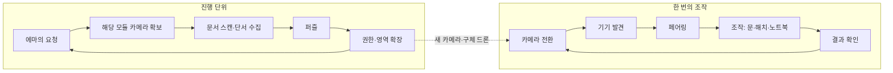

# 역기획서: Observation — 몸 없는 AI의 시점 조작

> - 대상: Observation (No Code, Devolver Digital, 2019)
> - 조사 범위: 우주정거장 AI 'SAM'의 조작 체계(고정 카메라, 시스템 페어링, 구체 드론), 승무원 요청 구조
> - 형식: 요약본 + NOMANUAL 0 이식 관점 / 작성일 2026-09-12
> - 주요 출처: 영문 위키백과, Game Developer 개발자 인터뷰, GamingBolt 개발자 인터뷰, TheSixthAxis 리뷰
> - 표기: 무표기 = 개발자 발언 또는 2곳 이상 일치, `[추정]` = 1곳만 확인. 설계 의도 해석은 작성자 추론

## 1. 시스템 개요

**한 줄 정의.** 플레이어는 사고가 난 우주정거장의 AI 'SAM'이 되어, 몸 없이 카메라와 기기만으로 생존한 승무원 에마 피셔를 돕는다. 카메라가 눈이고, 문·해치·노트북 같은 기기가 손이다. 인간 주인공을 조종하는 대신 공간 자체를 조종하게 만든 것이 이 게임의 출발점이다.

**경계.** 이 문서가 다루는 범위는 세 가지다.
- 고정 카메라: 모듈 곳곳의 벽 카메라를 옮겨 다니며 보는 기본 시점
- 시스템 페어링: 보고 있는 기기에 연결해 조작하는 절차
- 구체 드론: 중반에 얻는 자유 이동 시점. 카메라가 없는 곳과 외부로 나간다

컷신 연출과 서사 해석은 뺀다.

**만든 사람.** 감독 존 매켈런은 Alien: Isolation의 UI 리드 출신이다. 개발 기간은 약 25개월 `[추정]`, 엔진은 Unity `[추정]`. 소규모 팀이 UI 설계 경험을 무기로 삼은 게임이라, 조작 체계가 곧 UI 체계다.

## 2. 코어 루프

**한 번의 조작.** 카메라를 옮겨 대상을 찾고, 그 기기와 페어링한 뒤에야 조작할 수 있다. 매켈런은 처음에 문을 보고 X를 누르게 했지만 "손가락으로 버튼을 누르는 것처럼 너무 인간적"이어서 페어링 절차를 넣었다고 밝혔다. 조작 한 번에 단계가 하나 늘어나지만, 그 한 단계가 플레이어를 사람이 아니라 기계의 자리에 앉힌다.

**진행 단위.** 에마가 요청하면 SAM이 관련 기기를 찾아 처리하고 결과를 알린다. 퍼즐은 도면의 선을 따라 입력하거나 제한 시간 안에 올바른 값을 고르는 식으로 단순하다. 문서를 스캔하면 SAM의 능력이 늘어난다 `[추정]`. 요청 → 해결 → 확장이 반복되면서 정거장이 조금씩 열리고, 확장된 영역이 다시 한 번의 조작에 쓸 카메라를 늘린다.

| | 벽 고정 카메라 | 구체 드론 |
|---|---|---|
| 이동 | 없음. 제자리에서 둘러봄 | 자유 이동 |
| 닿는 곳 | 카메라가 설치된 모듈 | 카메라가 없는 곳, 정거장 외부 |
| 느낌 | 지켜보는 감시자 | 떠다니는 존재 |
| 비판 | — | 조작이 예민하고 길을 잃기 쉬움(리뷰 2곳) |

## 3. 종합 설계 의도

**공간이 곧 나.** 매켈런은 "SAM이 곧 정거장이므로 내부를 탐험하는 것은 자기 자신을 탐험하는 것"이라고 설명했다. 고정 카메라는 볼 수 있는 범위를 제한해서 플레이어를 행동하는 사람이 아니라 지켜보는 관찰자로 만든다. 카메라 사이를 옮겨 다니는 번거로움이 곧 몸 없는 존재의 감각이다.

**서로 기대는 관계.** TheSixthAxis 리뷰는 에마가 SAM에 기대는 만큼 SAM도 에마에게 기댄다고 적는다. SAM이 스스로 할 수 없는 일이 있어서 인간의 손을 빌려야 하고, 그 불완전함이 요청과 대화를 게임 진행의 동력으로 만든다.

**실패보다 긴장.** 개발진은 일반적인 실패 상태 없이 몰입하게 만들고 싶었고, 목표를 "완전한 공포가 아니라 불안한 분위기의 스릴러"로 잡았다. 게임 오버로 되돌리는 대신 연출과 속도로 긴장을 끌고 간다. 대가로 퍼즐이 쉽고, 이미지를 훑어 코드를 찾는 구간처럼 긴장 없이 늘어지는 곳이 생긴다는 비판을 받았다.

**비용을 연출로 바꾸기.** 모든 화면을 카메라 영상으로 보여 주는 VHS 셰이더는 게임에서 가장 비싼 후처리지만, 저예산에서 전체 룩을 한 번에 통일한다. 대사를 닫힌 문 너머로 처리해 애니메이션 비용을 줄이기도 했다 `[추정]`. 대가로 드론 조작의 불편함은 끝까지 남았고, 평가는 PC 79점, PS4 75점(메타크리틱) `[추정]`에 머물렀다.

## 4. NOMANUAL 0 이식 관점

- **그대로 쓸 것: 페어링 → '깃들기'.** 루즈벨트는 몸이 없으니 전화기, 전등, 액자, 예약 단말 같은 사물에 먼저 깃들어야 조작할 수 있다. 깃들 수 있는 대상을 1편에서 경비원이 쓰던 사물로 한정하면 1편과의 연결이 곧 조작 목록이 된다.
- **그대로 쓸 것: 고정 시점 → 사진과 그림.** 호텔의 사진, 그림, CCTV를 루즈벨트의 눈으로 삼는다. 1편 메시지 "호텔 내 새로 생긴 사진들이 보인다면, 절대 똑바로 쳐다보지 마"가 거꾸로 설명된다.
- **규모에 맞는 것: 비용을 연출로.** 대사를 닫힌 문 너머나 전화로 처리하고, 룩을 후처리로 통일하는 방식은 소규모 팀에 그대로 맞는다. Fatum Betula식 320×240 저해상도 렌더와 합치면 비용과 분위기를 함께 잡는다.
- **안 맞는 것: 자유 비행 드론.** 조작이 불편하다는 비판이 있고, 중간계 연출과 겹치면 공간 감각이 더 흐려진다. 루즈벨트의 이동은 깃든 사물 사이를 건너뛰는 방식으로 제한하는 편이 낫다.
- **의미가 바뀌는 것: 요청의 방향.** Observation은 인간이 요청하고 AI가 돕는다. NOMANUAL 0에서는 루즈벨트가 전화와 쪽지로 요청하고 인간(경비원)이 움직인다. 돕는 척하며 제물로 이끄는 관계라서, 에마와 SAM의 신뢰가 속임수로 뒤집힌다.
- **두 레퍼런스 결합.** SIREN의 무방비 규칙과 합치면 "사물에 깃들어 있는 동안 중간계의 루즈벨트는 무방비"라는 하나의 긴장 축이 나온다(`역기획서_SIREN_시야훔쳐보기.md` 4장).
