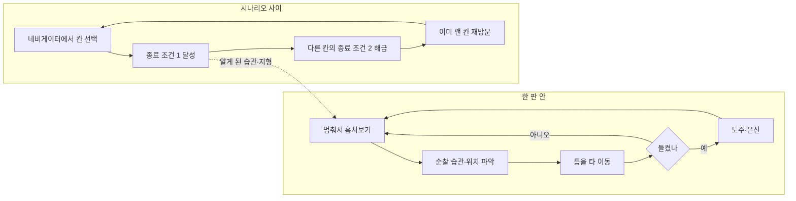

# 역기획서: SIREN — 시야 훔쳐보기와 링크 네비게이터

> - 대상: SIREN (SCE Japan Studio, PS2, 2003, 감독 도야마 게이이치로)
> - 조사 범위: 시야 훔쳐보기(Sightjack), 링크 네비게이터, 종료 조건 2. 전투와 아이템은 제외
> - 형식: 요약본 + NOMANUAL 0 이식 관점 / 작성일 2026-09-12
> - 주요 출처: 영문 위키백과, GameSpot 리뷰, 일본어 위키백과, GameFAQs 공략(검색 결과 기준)
> - 표기: 무표기 = 2곳 이상 일치, `[추정]` = 1곳만 확인. 설계 의도 해석은 작성자 추론

## 1. 시스템 개요

**한 줄 정의.** SIREN은 인물과 시간대로 쪼갠 시나리오를 오가며, 되살아난 마을 주민 '시비토'를 피해 목표를 달성하는 스텔스 공포 게임이다. 시야 훔쳐보기는 가까운 시비토나 사람의 눈과 귀를 빌리는 능력이고, 링크 네비게이터는 시나리오를 인물×시간 표로 늘어놓은 선택 화면이다. 앞의 것은 한 판 안의 정보를, 뒤의 것은 판과 판 사이의 인과를 맡는다. 무기로 싸우기보다 보고 숨는 것이 기본 행동이 되도록 두 장치가 뼈대를 이룬다.

**시야 훔쳐보기.** 주변 인물의 시점으로 보고 들어서 위치, 순찰 경로, 관심 지점과 아이템을 알아낸다. 아날로그 스틱으로 방향을 돌리며 라디오 주파수를 맞추듯 시점을 찾고, 찾은 시점은 버튼에 등록해 바로 전환한다(등록 가능한 개수는 `[미확인]`). 시야의 선명도는 거리에 따라 달라진다 `[추정]`. 가장 중요한 제약은 **훔쳐보는 동안 캐릭터가 움직일 수 없고 무방비라는 점**이다. 정보를 얻으려면 몸을 멈춰야 하므로, 플레이어는 안전한 자리를 먼저 찾은 뒤에 보는 순서를 몸에 익힌다.

**링크 네비게이터.** 3일간의 사건을 행은 시간, 열은 인물로 나눈 표로 보여 주고, 칸을 골라 그 인물의 시나리오를 플레이한다. 플레이 가능한 인물은 10명이다 `[추정]`. 시나리오가 시간 순서로 강제되지 않아서, 플레이어는 이야기를 시간 순이 아니라 **조각을 맞추는 순서**로 모은다. 전체 사건을 위에서 내려다보는 시점이 생기는 것이 이 표의 역할이다.

## 2. 코어 루프

**한 판 안.** 훔쳐보기 → 파악 → 이동을 초 단위로 반복한다. 시비토는 소리가 난 방향을 찾아가고, 플레이어를 발견하면 소리를 질러 주변을 부르며, 놓치면 원래 하던 일로 돌아간다. 치명상도 곧 회복하는 불사에 가깝다 `[추정]`. GameSpot 리뷰는 순찰 중인 시비토가 갑자기 멈춰 옆을 볼지 확인하려고 동작 전체를 훔쳐봐야 했다고 적는다. 적을 처치해서 없애는 선택지가 막혀 있으니, 플레이어의 실력은 적의 **습관을 읽는 능력**으로 정의된다.

**시나리오 사이.** 각 시나리오에는 목표인 '종료 조건'이 있고, 두 번째 목표는 다른 시나리오를 깨야 열린다.

| | 종료 조건 1 | 종료 조건 2 |
|---|---|---|
| 내용 | 출구 도달, 시비토 제압, 아이템 획득 등 기본 목표 | 추가 목표 |
| 열리는 시점 | 처음부터 | 다른 시나리오를 클리어하는 등 조건 충족 후 |
| 적용 범위 | 전 시나리오 | 첫 시나리오를 뺀 전부 `[추정]` |

한 인물의 행동이 다른 인물의 시나리오에 새 목표를 만드는 이 연결을 위키와 리뷰는 '나비효과'라고 부른다. 같은 공간을 다시 찾을 이유가 생기고, 재방문 때는 이미 아는 습관과 지형 덕에 정찰이 빨라진다. 두 루프는 여기서 맞물린다. 시나리오 사이 루프가 만든 지식이 한 판 안의 루프를 짧게 만든다.

## 3. 종합 설계 의도

- **보는 순간 무방비가 된다.** 정보와 안전을 맞바꾸게 해서, 훔쳐보기가 공짜 레이더가 아니라 매번 결정을 요구하는 행동이 된다. 대가로 흐름이 자주 끊기고, 초반에는 멈춰 서 있는 시간이 길어진다.
- **적의 일상을 엿본다.** 시비토가 제 할 일을 반복하는 모습을 그들의 눈으로 보게 되면서, 괴물 속에 남은 '살던 사람'이 보인다. 도야마는 공포를 "정상과 비정상의 경계에 걸친 불안한 감정"으로 정의했다 `[추정]`. 훔쳐보기는 그 경계를 가장 가까이서 보여 주는 장치다.
- **정보가 유일한 무기다.** 도야마는 아이템 파밍, 거대 보스, 즉시 회복, 인벤토리 퍼즐을 스스로 금지했다 `[추정]`. 다른 해결 수단을 걷어 내서, 플레이어가 믿을 수 있는 것은 본 것뿐이 된다.
- **대가: 시행착오.** 무엇을 봐야 하는지, 종료 조건 2를 어떻게 여는지 알려 주는 장치가 적어서 비평은 시행착오와 난이도를 문제로 꼽았다. 메타크리틱 72점 `[추정]`. 무력감을 연출하려고 고른 설계가 그대로 진입 장벽이 됐다.

## 4. NOMANUAL 0 이식 관점

| 구분 | 내용 |
|---|---|
| 그대로 쓸 것 | **훔쳐보는 동안 무방비.** 루즈벨트가 경비원의 시야에 들어가 있는 동안, 중간계에 남은 루즈벨트가 가미긴의 위협에 노출된다. 조종과 생존이 한 자원(주의력)을 두고 다툰다 |
| 그대로 쓸 것 | **습관 읽기.** 1편의 근무 목록(1시간 단위 업무)이 곧 경비원의 순찰 습관이다. 루즈벨트에게 근무 목록은 먹잇감의 일과표가 된다 |
| 규모에 맞게 줄일 것 | 인물 10명 × 3일 표 → 경비원 3명 × 근무 시간(0~4시) 칸. 종료 조건 2 → 앞선 루프에서 남긴 쪽지·예약이 다음 루프의 새 수단을 여는 구조 |
| 의미가 바뀌는 것 | 살아남으려는 정찰이 사냥을 위한 정찰이 된다. 엿보는 행위 자체가 루즈벨트의 죄를 플레이어에게 떠넘기는 장치가 된다 |
| 주의할 것 | 시행착오 피로가 시간 되돌리기(루프)와 겹치면 반복 피로가 두 배가 된다. 되돌려도 알아낸 정보는 남기고, 다음에 할 일을 넌지시 알려 주는 장치가 필요하다 |
