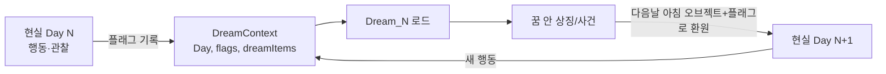
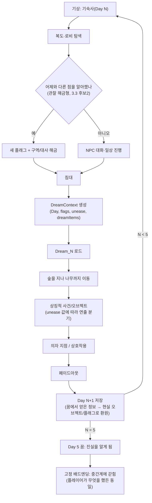

# 역기획서: 날짜 제한 사이클과 꿈↔현실 순환

> - 대상: Pathologic 2 / Majora's Mask / Mouthwashing(날짜 제한 사이클), Yume Nikki / LSD: Dream Emulator / Persona 5 / Pathologic 2 / Silent Hill(꿈↔현실 순환), Signalis / Resident Evil / Observation / The Exit 8(제한 구역 해금)
> - 조사 범위: NOMANUAL 0(Roosevelt) 8~9장이 요구하는 세 축 — 날짜 제한 사이클, 꿈↔현실 순환, 제한 구역 해금 진행. 전투·성장·재화 시스템은 다루지 않음
> - 형식: 역기획서 스킬 기준(관찰→사례→의도) + Roosevelt 이식안·위험을 문단마다 추가 / 작성일 2026-09-16
> - 먼저 읽음: `01_기획/0일차_기획.md`(5·8·9장), `02_세계관/세계관_리좀솔루션.md`, `05_레퍼런스_분석/역기획서_SIREN_시야훔쳐보기.md`(형식 참고)
> - 주요 출처: 각 게임 공식/전문 위키(Fandom, wiki.gg), GameFAQs, 게임 디자인 비평 매체(Medium, Kritiqal, Game Developer). 표기: 무표기 = 2곳 이상 일치 또는 개발자 인터뷰급 출처, `[추정]` = 출처 1개거나 버전이 불확실, `[미확인]` = 근거를 못 찾았으나 구조상 언급 필요. 설계 의도 해석(③)은 작성자 추론이며 표기를 붙이지 않음
> - 개발 루트(`Roosevelt/`) 코드는 열람하지 않았다. 이식안의 데이터 형태는 `0일차_기획.md` 5·8장에 이미 적힌 설계(GameState Day, 플래그, DreamContext, Dream_00~05 씬 구조)를 그대로 확장한 것이지, 실제 구현을 확인한 것이 아니다

## 0. 이 문서가 다루는 것

세 게임군은 각각 Roosevelt의 서로 다른 구멍을 메운다. Pathologic 2·Majora's Mask·Mouthwashing은 "하루"를 어떻게 단위로 쪼개고, 며칠이 지났는지를 플레이어에게 어떻게 알리며, 결국 결말이 정해져 있다는 사실을 플레이어가 받아들이게 만드는 방법을 보여준다. Yume Nikki·LSD: Dream Emulator·Persona 5·Silent Hill은 현실과 꿈(또는 두 공간)이 서로의 상태를 읽고 쓰는 방법을 보여준다. Signalis·Resident Evil·Observation·The Exit 8은 `0일차_기획.md` 9장이 비워 둔 "제한 구역을 여는 방법"의 후보를 제공한다.

세 축은 독립적이지 않다. Roosevelt의 8장 코어 루프("현실 행동 → 플래그/DreamContext 기록 → 수면 → 꿈이 바뀜 → 꿈 아이템 → 현실 실험 → 새 플래그 → 다음 꿈 변화")는 날짜 축(언제) 위에서 꿈-현실 축(무엇이 순환하는가)이 돌고, 그 순환의 산출물이 제한 구역 축(어디가 열리는가)을 채우는 구조다. 아래 각 절은 이 구조를 채우기 위한 재료다.

---

## 1. 축 1 — 날짜 제한 사이클

### 1.1 Pathologic 2: 12일, 실시간 압박과 자원

**구조.** Pathologic 2는 12일 안에 끝난다. 일부 자료는 실질적으로 플레이 가능한 날을 11일로 보고 마지막 날을 에필로그로 취급한다 `[추정]`. 날짜가 지날수록 게임 내 시간이 빨라져, 초반에는 현실 1분이 게임 내 약 14.5분이던 것이 후반에는 그 두 배 이상으로 가속된다 `[추정]`. 플레이어는 체력·허기·갈증(또는 스태미나)·면역(또는 감염)·평판 다섯 축의 생존 게이지를 동시에 관리한다.

**사례.** 평판은 구역(district) 단위로 따로 매겨진다. 도둑질처럼 가벼운 행동은 그 구역의 평판만 깎지만, NPC를 공격하는 등 무거운 행동은 인접 구역까지 물든다. "환영받지 못함(Unwelcome)"이 되면 성인과의 거래·상점 이용이 막히고, "미움받음(Hated)"까지 가면 민병대가 거리에서 먼저 공격한다. 죽음도 되돌릴 수 없는 대가를 남긴다. 세이브를 불러와도 죽음으로 깎인 생존 스탯 일부는 복구되지 않아, 죽음이 임시 실패가 아니라 영구적인 흉터로 쌓인다는 분석이 있다 `[추정]`.

**의도.** 시간이 자원이 되는 순간 모든 선택은 기회비용을 갖는다. 12일이라는 총량과 날마다 빨라지는 속도는 플레이어가 "이번 생에 전부 할 수 없다"는 사실을 몸으로 익히게 만든다. 이는 [자원 압박] 렌즈다 — 무한히 쓸 수 없는 것이 있는 순간 플레이어는 전투나 탐사를 순간 판단이 아니라 배분 문제로 다루게 된다. 평판을 구역별로 쪼갠 것도 같은 논리다. 한 곳에서 저지른 실수가 전체 맵을 막지 않게 해서, 플레이어가 "이 구역은 포기하고 저 구역에 집중"하는 지역적 손절을 하게 만든다. 죽음의 영구적 흉터는 세이브-로드로 시행착오를 지우는 습관 자체를 막아, 플레이어가 매 순간을 "다시 안 오는 하루"로 느끼게 한다.

### 1.2 Majora's Mask: 3일 루프와 일정표

**구조.** 클락타운을 포함한 터미나는 정확히 3일(게임 내 72시간) 뒤 달이 떨어지며 리셋된다. 플레이어는 시간의 노래로 아무 때나 첫날 아침으로 되돌릴 수 있다. 부머스 노트북은 링크가 만난 NPC 최대 20명의 일정을 기록하는 수첩으로, 각 인물이 "언제 어디서" 상호작용 가능한지 3일 내내의 스케줄을 보여준다.

**사례.** 시간을 되돌리면 그 루프 안에서 도운 사람은 도움받았다는 사실 자체를 잊는다. 그런데도 노트북에 적힌 항목과 받은 해피 스티커는 사라지지 않고 남는다. 아이템 보존도 계층이 있다. 메이저 아이템(가면·중요 장비)은 리셋을 넘어 남고, 던전 열쇠 같은 소모품과 돈은 은행에 맡기지 않으면 사라진다 `[추정]`(출처 신뢰도 낮음, GameFAQs 답변 기준). 부엉이 석상 세이브는 N64판 기준 한 번 쓰면 그 기록을 불러오는 즉시 지워지는 일회용이라, 실질적으로는 "안전하게 종료하기용" 체크포인트에 가깝다.

**의도.** 부머스 노트북은 [정보 비대칭] 렌즈로 읽힌다 — 세계는 리셋되지만 플레이어의 지식은 리셋되지 않는다. 첫 루프에서 헤매며 알아낸 "누가 몇 시에 어디 있는지"가 다음 루프부터는 그대로 공략집이 된다. 이 비대칭이 반복을 작업이 아니라 숙련으로 바꾼다. 아이템 보존의 계층 설계(메이저 아이템은 남고 소모품은 사라짐)는 리셋의 대가를 조절하는 장치다. 모든 걸 잃으면 리셋을 피하게 되고, 아무것도 잃지 않으면 리셋에 무게가 없어진다. 메이저 아이템만 남기고 나머지를 지움으로써, 플레이어는 "이 루프에서 확보한 것 중 무엇을 은행에 넣고 무엇을 포기할지"를 매번 판단하게 된다.

### 1.3 Mouthwashing: 비선형 챕터로 고정 결말 먼저 보여주기

**구조.** Mouthwashing은 Jimmy(추락 이후 현재)와 Curly(추락 이전 과거) 두 시점을 오간다. 첫 화면부터 "추락 0일 전"이라는 타이틀 카드를 띄우고, 이후 "추락 6주 후", "추락 2일 전", "심판까지 1시간" 같은 표제로 시점을 계속 건너뛴다.

**사례.** 결말(우주선 추락)은 오프닝에서 이미 확정된 사실로 제시된다. 플레이어는 "무슨 일이 일어날까"가 아니라 "왜 이렇게 됐나"를 좇는 입장이 된다. 리뷰들은 이 비선형 배치를 극적 아이러니의 도구로 짚는다 — 추락을 안 상태로 그 전의 인물들을 지켜보는 것 자체가 공포의 원천이 된다는 것이다.

**의도.** 이는 Roosevelt가 가장 직접 참고할 수 있는 사례다. "무엇을 해도 결말은 같다"를 스포일러가 아니라 설계로 만드는 방법이 바로 **결말을 감추지 않고 맨 앞에 제시**하는 것이다. 플레이어의 질문을 "어떻게 될까"에서 "왜 그렇게 될 수밖에 없었나"로 옮기면, 고정 결말은 배신이 아니라 약속이 된다. 대가도 있다. 이 구조는 미스터리가 전개보다 캐릭터 동기와 인과 관계에 있다는 것을 전제로 하므로, 플레이 중 긴장을 유지하려면 "언제·어디서"가 아니라 "누가·왜"에 필적하는 밀도로 캐릭터를 그려야 한다. 그 밀도가 없으면 알고 있는 결말을 향해 걷기만 하는 지루한 진행이 된다.

### 1.4 종합 — 하루의 구성, 변화, 전달, 그리고 수용

| 질문 | Pathologic 2 | Majora's Mask | Mouthwashing |
|---|---|---|---|
| 하루의 구성 단위 | 가속되는 실시간 시계 + 구역별 사건 | 고정된 72시간 + 인물별 스케줄 | 표제로 나뉜 비연속 시점(전/후/시간) |
| 무엇이 날마다 바뀌나 | 평판·감염·재고, 시간 가속률 | NPC 위치·대사·이벤트 발생 시각 | 시점(누구·언제)만 바뀌고 사건은 고정 |
| 진행 정보 전달 | 대화·소문(간접적, 명시적 UI 약함 `[미확인]`) | 부머스 노트북(명시적 리스트+체크) | 타이틀 카드(장면 자체가 알림) |
| "결말은 같다" 수용 방식 | 죽음도 흔적을 남기므로 매 순간이 유일함을 체감 | 리셋해도 "알게 된 것"은 남아 반복이 숙련이 됨 | 결말을 먼저 보여줘 질문을 "왜"로 바꿈 |

세 게임 모두 리셋되는 것(세계)과 리셋되지 않는 것(플레이어의 지식)을 명확히 나눈다. Roosevelt는 날짜가 리셋되지 않고 누적된다는 점에서 셋 다와 다르지만, "무엇을 해도 5일차 결말은 같다"는 전제는 Mouthwashing과 가장 가깝다. 다만 Roosevelt는 Mouthwashing처럼 결말을 0일차에 문자 그대로 보여줄 필요는 없다 — 세계관 문서(02_세계관) 자체가 "루즈벨트는 훗날 악인이 된다"는 사실을 1편에서 이미 공개했으므로, 이 게임을 1편 이후에 접한 플레이어에게는 이미 Mouthwashing식 극적 아이러니가 발동돼 있다. 1편을 모르는 플레이어에게도 같은 효과를 주려면 0일차 안에서 결말의 그림자를 미리 보여줄 장치가 필요하다.

### 이식안 — 데이터 형태

Roosevelt의 하루는 실시간 시계가 아니라 `GameFlow`가 관리하는 이산적 진행이므로, Pathologic식 실시간 압박보다는 Majora's Mask의 "이산 블록 + 목록"과 Mouthwashing의 "표제로 알리기"가 이식하기 쉽다.

- **시간대 블록**: `GameState`에 `Day`(0~5)만 있던 것에 `DayPhase`(예: `Morning`/`Free`/`Night`) 같은 경량 열거값을 더한다. Reality 씬은 하나뿐이므로 실시간 시계 대신 "NPC와 대화를 마치면 Free로, 침대에 누우면 Night로" 식으로 **플레이어 행동이 블록을 넘기는** 구조를 쓴다. Pathologic의 실시간 가속은 Roosevelt가 "지금 만들지 않음"으로 명시한 압박형 시스템과 충돌하므로 가져오지 않는다.
- **일지(부머스 노트북 축소판)**: 새 UI를 만들기보다, 이미 있는 F1 디버그 패널의 플래그 표시를 확장해 "오늘까지 알아낸 것" 목록을 플래그 설명 텍스트와 함께 노출하는 정도로 충분하다. 데이터는 새 구조체 없이 기존 `Flag` 컬렉션에 설명 문자열만 매핑하면 된다: `flagDescriptions: Dictionary<string, string>`.
- **표제 연출**: Day가 바뀔 때 이미 있는 "Day 1" 캡션(0일차 기획 6단계)을 Mouthwashing식으로 확장해, 5일차 결말을 완전히 밝히지 않되 그림자를 드리우는 짧은 문구를 날짜마다 다르게 띄운다. `DaySummary { day: int, captionText: string }` 하나로 충분하고, 이는 이미 있는 전환 시스템(`ScreenTransition`)에 텍스트 레이어만 얹으면 된다.

### 위험

Pathologic의 실시간 압박과 구역별 평판을 통째로 들여오면 0일차 기획서 6장이 명시적으로 제외한 "체력·전투·퀘스트 UI" 수준의 복잡도가 되돌아온다. Majora's Mask의 20인 스케줄표는 Roosevelt의 NPC 수(현재 로비 연구원 등 극소수)에 비해 과설계다. 표를 흉내 내려면 인물부터 늘려야 하는데, 이는 8단계까지 끝난 현재 진행(연구원 20본 리깅 등)을 감안하면 제작비가 크다. Mouthwashing식 비선형 표제는 현재 "Reality 씬 하나 + Day·플래그로 차이만 켜고 끔" 구조와 잘 맞지만, 진짜 시간 점프(과거 챕터 재생)를 넣으려면 같은 공간을 다른 시대 상태로 다시 그려야 해서 지금의 단일 Reality 씬 설계를 벗어난다. 표제 연출만 가볍게 쓰고 실제 챕터 점프는 하지 않는 것을 권한다.

---

## 2. 축 2 — 꿈↔현실 순환

### 2.1 Yume Nikki: 이펙트 수집과 침대/책상

**구조.** 마도츠키의 방에는 침대와 책상이 있다. 침대에 누우면 넥서스(꿈 허브)로 들어가고, 책상 앞에서 상호작용하면 의자를 밀며 방 안을 돌아다닐 수 있다. 꿈 속에는 총 24개의 이펙트가 흩어져 있고, 이를 모으면 마도츠키의 외양이 바뀌거나 특정 장소에 접근할 수 있게 된다. 이펙트는 순서 제약이 거의 없이 자유롭게 모을 수 있지만, 똥머리(Poop Hair) 이펙트만은 유키온나 또는 우산 이펙트를 먼저 얻어야 한다.

**사례.** 꿈 속 곳곳에 놓인 침대와 상호작용하면 다섯 곳의 침대 중 하나로 확률적으로 이동하는 지름길 역할을 한다 `[추정]`(단일 출처, 정확한 확률 구조 미확인). 이펙트 대부분은 장식적이고, 일부만 잠긴 문·다리 같은 기믹을 여는 열쇠 역할을 한다.

**의도.** [목표 다층화] 렌즈다. 24개를 다 모으는 완주형 목표와, 그냥 이상한 풍경을 돌아다니는 탐험형 목표가 공존한다. 순서 제약이 거의 없다는 점이 중요하다 — 정해진 경로가 없으므로 플레이어마다 다른 순서로 세계를 알아가고, "이걸 먼저 봤어야 했다"는 실패가 발생하지 않는다. 다만 이 개방성은 방향성이 없는 탐험을 오래 견딜 플레이어를 전제로 한다. 명확한 서사 목표가 있는 Roosevelt에는 이 완전 개방형 구조가 맞지 않는다.

### 2.2 LSD: Dream Emulator: 전날의 결과가 다음 꿈을 결정하는 그래프

**구조.** 매 꿈이 끝나면 그래프(차트)가 나타난다. 이 그래프는 가로축 정적(Static)-동적(Dynamic), 세로축 업(Upper)-다운(Downer) 네 극을 가진 좌표계다. 정적/동적은 그 꿈이 장면을 얼마나 자주 바꿨는지, 업/다운은 그 꿈이 감정적으로 긍정적이었는지 부정적이었는지를 나타낸다고 설명서(매뉴얼 카드)가 밝힌다. 이 좌표의 위치가 다음 꿈이 어느 구역(필드)에서 시작할지를 정한다.

**사례.** 꿈 안에서는 "링크(Linking)"라는 이동 규칙이 전부다. 아무 표면이나 존재에 부딪히면 화면이 색으로 페이드되며 다른 장소로 넘어간다. 존재와 부딪히는 정적 링크는 항상 같은 곳으로 가고, 대부분의 표면과 부딪히는 동적 링크는 여섯 개 주요 필드 중 하나로 무작위에 가깝게 이동한다 `[추정]`(단일 출처). 게임은 실제로 이런 방식의 꿈을 365일(1년) 기록하면 특별한 엔딩 컷신을 보여준다. 이 구조는 개발사 직원이 약 10년간 써 온 실제 꿈 일기에서 착안했다.

**의도.** [정보 비대칭] 렌즈와 맞닿아 있다. 그래프는 "네가 방금 겪은 꿈이 어떤 성질이었는가"를 수치화하지만, 그 수치가 정확히 무엇을 바꾸는지는 설명하지 않는다. 리뷰·위키 모두 "경향은 있지만 일관된 규칙은 찾기 어렵다"고 적는다. 이건 실패한 설계가 아니라 의도된 불투명함이다 — 꿈이 논리적으로 설명되면 꿈이 아니게 된다는 전제가 깔려 있다. 다만 이 불투명함은 명확한 서사적 인과가 필요한 게임에는 위험하다. 원인과 결과가 안 보이면 플레이어는 "내 행동이 의미가 있나"를 의심하게 된다.

### 2.3 Persona 5·Pathologic: 이중 공간과 현실이 꿈(팔레스)에 새기는 마감

**구조.** Persona 5는 학교·사회 활동이 일어나는 현실 공간과, 팰리스(던전)가 일어나는 메타버스를 오간다. 평일은 등교·제한된 사교로 이중생활을 강조하고, 주말·공휴일에 팰리스 잠입이나 큰 이벤트가 풀린다. 각 팰리스에는 명시적인 마감일이 있다. 예를 들어 마감 3일 전까지 보물방을 찾아야, 그다음 날 예고장을 보내는 일정이 맞물린다. 기한을 넘기면 그 타깃을 잃는다 `[추정]`(정확한 페널티는 버전에 따라 다를 수 있음).

**사례.** 일정을 일찍 끝내면 남는 날은 사교(컨피던트 랭크업)나 스탯 훈련에 자유롭게 쓸 수 있다. 즉 던전(비일상 공간)의 진행 속도가 현실(일상 공간)에서 쓸 수 있는 시간의 총량을 결정한다.

**의도.** [자원 압박]과 [진입 장벽] 렌즈가 겹친다. 마감은 팰리스 탐사 자체보다 "현실에서 무엇을 할지"를 압박하는 장치에 가깝다. 이중 공간을 경쟁 관계로 설계하면, 플레이어는 매일 "오늘 하루를 어디에 쓸까"를 계산하게 된다. Roosevelt의 8장 코어 루프도 구조적으로 이와 같다 — 현실에서 쓴 하루가 꿈의 내용을 정하고, 꿈에서 얻은 것이 다시 현실에서 쓸 하루의 선택지를 바꾼다. 다만 Persona는 두 공간이 경쟁(제로섬)하지만, Roosevelt의 현재 설계(8장)는 두 공간이 순차적으로 누적되는 협력 관계에 가깝다. 이 차이는 아래 이식안에서 다시 짚는다.

### 2.4 Silent Hill: 같은 공간을 다시 그리는 이계 전환 `[참고, 부분 이식]`

**구조.** 안개 세계(Fog World)와 그 이면의 이계(Otherworld)는 같은 건축을 공유하지만 다른 재질과 조명으로 다시 칠해진다. 시리즈 초기작은 문·복도를 지나거나, 기절 후 깨어나거나, 보스전 이후 암전으로 전환한다. Origins에서는 거울을 통해 두 세계를 오갈 수 있다.

**사례.** Homecoming에서는 안개 세계의 벽과 바닥이 벗겨지며 그 아래 녹슨 산업 시설이 드러나는 연출로 전환을 보여준다.

**의도.** [정보 비대칭]보다는 공간 재활용에 가까운 렌즈다 — 같은 지형을 다시 쓰되 의미만 바꿔서, 플레이어가 이미 외운 지도를 낯설게 다시 읽게 만든다. Roosevelt는 현재 현실(Reality)과 꿈(Dream_00~05)이 완전히 다른 공간(기숙사 실내 vs 야외 숲)이라 이 기법을 그대로 쓸 수 없다. 다만 후반 일차의 꿈에서 연구소 복도의 일부가 뒤틀린 형태로 재등장하는 식의 확장은, 완전히 새 아트를 만들지 않고도 "현실이 침식당하고 있다"는 인상을 줄 수 있는 저비용 연출로 메모해 둘 만하다.

### 2.5 종합 — 읽기, 형태, 피로 감소

**꿈이 현실 행동을 읽는 방식.** 세 갈래로 나뉜다. Yume Nikki는 안 읽는다(이펙트 수집은 누적형이지 조건부가 아니다). LSD는 직전 한 판의 결과만 수치 두 축으로 압축해 읽는다. Persona·Pathologic은 진행 상태(마감까지 남은 날, 획득한 정보)를 그대로 다음 판의 조건으로 넘긴다. Roosevelt의 DreamContext(Day·플래그·아이템)는 Persona/Pathologic 쪽 모델에 가깝다 — 이미 "무엇을 읽을지"가 정해져 있으므로, LSD식 불투명한 압축보다는 명시적 조건 읽기가 지금 설계와 맞는다.

**꿈에서 가져오는 것의 형태.** Yume Nikki의 이펙트는 시각적 상태 변화(외형)다. LSD는 다음 시작 위치라는 메타 정보다. Persona는 실물 전리품(보물)이다. Roosevelt는 6장에서 인벤토리를 이미 배제했으므로, "가져오는 것"은 실물 아이템이 아니라 **현실 오브젝트의 상태 변화 + 새 플래그**로 구현하는 편이 지금 설계와 맞는다. 예를 들어 꿈에서 상징을 본 다음 날 아침, 기숙사 방 어딘가에 그 상징을 닮은 오브젝트가 놓여 있는 식이다.

**반복 방문 피로를 줄이는 방법.** Majora's Mask의 노트북(위 1.2절)과 같은 원리다 — 세계는 반복돼도 플레이어의 지식은 반복되지 않게 한다. 꿈 씬을 다시 방문할 때 이미 본 구간의 이동 연출(나무까지 걸어가는 긴 구간 등)을 단축하거나, 이미 들은 환경음·독백을 생략하는 것으로 충분하다. Persona처럼 매번 다른 콘텐츠를 채워 넣는 방법은 제작비가 크다.



### 이식안 — 데이터 형태

- **DreamContext 확장**: `DreamContext { day: int, flags: HashSet<string>, dreamItems: List<string> }`에 LSD의 그래프를 아주 얕게 흉내 낸 단일 수치 하나만 추가한다. 예: `unease: int` — 특정 플래그(몰래 훔쳐봄, 잠긴 문을 억지로 열려 함 등)가 설정될 때마다 증가. 이 값은 절차적 꿈 생성에 쓰지 않고(6장에서 이미 제외), Dream_NN 씬 안의 **미리 만들어 둔 몇 가지 연출 분기**(안개 밀도, 나무 근처 잡음, 의자 앞 대기 시간 등)를 고르는 스위치로만 쓴다.
- **가져오는 것의 형태**: 새 인벤토리 구조 대신, `DreamItem`을 "현실 씬의 특정 프리팹을 활성화하는 키"로만 쓴다. `RealityWorldState.Reveal(dreamItemId)` 한 함수로 충분하다. 이는 이미 있는 "Day·플래그로 방 안의 차이를 켜고 끔"(기획서 5장 씬 설명) 방식의 연장선이다.
- **반복 방문 단축**: Dream_NN 씬에 `visitedBefore` 플래그를 두고, 이동 구간의 웨이포인트를 스킵하거나 페이드 전환 시간을 줄이는 정도로 처리한다. 새 시스템이 아니라 기존 `ScreenTransition`·`TransitionDoor` 설정값 조정 수준이다.

### 위험

LSD의 그래프를 그대로 들여오면 플레이어가 "내가 무엇을 했길래 꿈이 이렇게 됐는지" 알 수 없어 8장이 원하는 "무엇을 봤나·가졌나·어떤 꿈을 꿨나"로 콘텐츠가 갈리는 감각과 반대로 간다 — 불투명도가 Roosevelt에는 독이 된다. Persona식 실시간 마감(팰리스 vs 사교)을 그대로 넣으면 선형 제작(기획서 1장 "제작은 선형으로 먼저")과 충돌한다. 지금은 하루에 꿈 하나이므로 "이 꿈을 며칠 안에 깨야 한다"는 마감 자체가 설 자리가 없다. 분기를 늘리는 후반 단계에서만 재검토할 것. Silent Hill식 공간 재활용은 아트 재사용 관점에서 매력적이지만, 지금 Dream_00 하나만 있는 상태에서 "현실 복도가 꿈에 뒤틀려 나온다"를 넣으면 나무·숲 중심으로 잡은 현재 꿈의 톤(02_세계관 7장 "인간·동물·기계 오염은 거의 보여주지 않는다")과 어긋날 수 있다.

---

## 3. 축 3 — 제한 구역 해금 진행

### 3.1 Signalis·Resident Evil: 열쇠와 접근 등급

**구조.** Signalis는 메트로이드베니아식 능력 해금(더블 점프 같은 이동 능력으로 새 길이 열리는 방식) 대신, 키 아이템이 이미 있는 길을 논리적으로 열어주는 방식을 쓴다. 인벤토리는 6칸뿐이라 무기·탄약·회복 아이템·키 아이템을 동시에 들고 다니기 빠듯하고, 세이브 룸의 보관함(스토리지)에 안 쓰는 것을 맡겨야 한다. Resident Evil 시리즈는 물리적 열쇠·키카드, 그리고 ID 완장(리스트밴드) 같은 등급형 출입증을 함께 쓴다. 일부 시설은 완장 색상별로 3단계 출입 등급을 나눈다 `[추정]`(최근작 사례 기준, 구작과 동일 여부 미확인).

**사례.** Signalis에서 키 아이템은 생존에는 도움이 안 되지만 진행에는 필수라, "이걸 들고 다닐 칸을 비워 둘 것인가"라는 결정이 매 순간 인벤토리 압박과 맞물린다. Resident Evil의 "고장난 부품이 있는 기계"류 장애물은 열쇠 자체보다 그 열쇠를 "어디서 쓰는지 기억하는" 부담을 플레이어에게 지운다는 분석이 있다 `[추정]`.

**의도.** [진입 장벽과 게이팅] 렌즈 중 "준비도" 게이팅에 해당한다. 열쇠형 게이팅은 실력이나 과금이 아니라 "이 구역을 열 자격이 되는 물건을 찾았는가"만 묻는다. 이건 순서를 강제하지 않으면서도 진행을 통제하는 저비용 방법이다 — 새 능력을 만들 필요 없이 오브젝트 배치와 문 하나로 구역 하나를 잠그고 열 수 있다. 대가는 뻔한 패턴화다. 열쇠-문 대응이 뻔해지면 탐색이 "빈 문 앞에서 되돌아가 맞는 열쇠를 찾는" 왕복 노동으로 느껴질 수 있다. Signalis가 인벤토리를 6칸으로 조인 것은 이 왕복을 없애는 대신 다른 긴장(무엇을 버릴까)으로 대체한 것이다.

### 3.2 Observation·The Exit 8: 관찰 기반 진행

**구조.** Observation은 플레이어를 우주정거장의 AI 'SAM'으로 놓고, 고정된 카메라 여러 대를 오가며 화면 속 조작반을 눌러 퍼즐을 푼다. 이야기가 진행될수록 조작 가능한 카메라·구역이 늘어나며, 퍼즐 난이도도 짧은 색상·숫자 패턴에서 여러 시스템이 얽힌 다단계 문제로 커진다. The Exit 8은 같은 지하도 구간을 반복 통과하며 레이아웃에서 이상 현상을 찾는다. 이상이 없으면 전진, 있으면 뒤돌아 되돌아가야 다음 구간(Exit 번호가 오름)으로 진행되고, 틀리면 Exit 0으로 되돌아간다. 이상 현상은 총 36종(VR판 한정 1종 추가)이며 한 루프에 최대 하나만 등장하고, 한 번 맞춘 이상 현상은 그 플레이 동안 다시 나오지 않는다.

**사례.** Observation은 "퍼즐 자체는 어렵지 않되 인터페이스를 손에 익히는 과정이 퍼즐의 일부"라는 철학을 내세운다. The Exit 8은 8번 연속으로 맞혀야 진짜 출구에 닿는다.

**의도.** 둘 다 [텔레그래프와 학습] 렌즈다. 관찰 기반 진행은 새로운 조작이나 전투 실력을 요구하지 않고, **이미 아는 공간에서 달라진 것을 알아채는 능력**만 요구한다. Observation은 이야기 진행에 맞춰 조작 가능 범위를 넓혀 나가는 것으로 "지금 볼 수 있는 것"의 총량을 통제한다. The Exit 8은 반대로 공간을 전혀 넓히지 않고, 같은 공간을 다시 보여주며 그 안의 차이만으로 통과 여부를 가른다. 두 방식 모두 새 리소스 제작량이 적다는 공통점이 있다 — 지형을 새로 만드는 대신 지형을 다시 보여주고 차이만 만든다.

### 3.3 제한 구역을 여는 방법 — 후보 3개

`0일차_기획.md` 9장이 비워 둔 항목이다. 세계관(02_세계관 7장)은 이미 "루즈벨트는 기억 이상으로 접근 등급이 낮아진 채 시작한다"는 전제를 깔아 두었으므로, 세 후보 모두 이 전제 위에서 출발한다.

**후보 1. 접근 등급형(Signalis·Resident Evil식).** 로비 NPC가 밝힌 "접근 등급만 낮췄다"(0일차 기획 3장)는 설정을 그대로 살려, 등급 카드나 서명 같은 오브젝트를 현실에서 얻을 때마다 복도의 잠긴 문이 하나씩 풀리는 방식이다. 근거는 이미 있는 `LabDoor`의 `locked` 필드와 잠긴 문에 뜨는 "잠겨 있다" 프롬프트(5장)가 이 구조를 전제로 설계돼 있다는 점이다. 새 시스템을 만들 필요 없이 잠금 조건을 단일 bool에서 플래그 기반으로만 바꾸면 된다.

**후보 2. 관찰 해금형(Observation·Exit 8식).** 매일 같은 로비·복도를 반복해서 지나가다, 어제와 달라진 지점(새로 열린 문틈, 자리를 옮긴 오브젝트, 낯선 소음)을 상호작용하면 새 플래그와 함께 구역이 열리는 방식이다. 근거는 두 가지다. 첫째, Reality가 이미 "씬 하나 + Day·플래그로 차이만 켜고 끔" 구조라 같은 공간을 다시 보여주는 The Exit 8식 반복에 최적화돼 있다. 둘째, "나무 근처에서는 기억 상실이 흔하다"(02_세계관 7장)는 설정이 "매일 아침 어제를 온전히 기억 못 하는 루즈벨트가 공간을 다시 관찰해야 하는" 서사적 필연을 만들어 준다.

**후보 3. 꿈-현실 순환형(2절의 DreamContext 순환과 결합).** 꿈에서 본 상징(나무 근처 지형, 의자 배치, 안개 속 실루엣)이 현실 구역의 위치 힌트가 되고, 그 힌트를 현실에서 특정 NPC에게 묻거나 특정 지점에서 확인하면 구역이 열리는 방식이다. 근거는 8장 코어 루프가 이미 "꿈에서 아이템 획득 → 현실에서 실험 → 새 플래그"라고 명시하고 있다는 점이다. 여기서 "아이템"을 물리적 인벤토리가 아니라 "정보/플래그"로 대체하면 6장이 배제한 인벤토리 시스템 없이도 이 순환을 그대로 구현할 수 있다.

세 후보는 배타적이지 않다. 후보 1은 골격(문이 잠겨 있다는 기본 UI/상호작용)을 제공하고, 후보 2와 3은 그 문을 여는 열쇠가 각각 "관찰"과 "꿈"에서 나온다는 차이만 있다. 두 개를 섞어 "일부 문은 관찰로, 일부 문은 꿈에서 얻은 단서로 열린다"로 가면 1~5일차 다섯 번의 순환에 변주를 줄 수 있다.

### 이식안 — 데이터 형태

```
AccessFlag: string                     // 예: "AccessCafeteria", "AccessArchive"
TransitionDoor {
  locked: bool
  requiredFlags: HashSet<string>       // 기존 locked bool을 대체/확장
  lockedPrompt: string                 // "잠겨 있다" 이외의 상태별 문구
}
ObservationPoint {                     // 후보 2용
  id: string
  activeFromDay: int
  noticedFlag: string
  onNoticed: () => SetFlag + 대사/연출
}
```

`TransitionDoor`의 `locked: bool`을 `requiredFlags`로 바꾸는 것은 이미 있는 잠금 프롬프트 UI를 그대로 재사용하면서 다중 등급을 표현할 수 있는 가장 작은 변경이다. `ObservationPoint`는 새 컴포넌트이지만 `IInteractable`을 그대로 구현하면 되므로 `PlayerInteraction`의 기존 레이캐스트 흐름에 끼워 넣을 수 있다.

### 위험

Resident Evil식 다단계 출입증(완장 3색 등)을 그대로 쓰면 관리해야 할 플래그·오브젝트가 빠르게 늘어난다. Roosevelt의 볼륨(작음, 엔딩 1종, 5일)에는 등급 2~3단계 이상은 과하다. 관찰 해금형(후보 2)의 약점은 The Exit 8처럼 "차이를 못 찾으면 진행이 막힌다"는 구조를 그대로 쓰면 플레이어가 뭘 찾아야 하는지 몰라 헤매는 시간이 길어진다는 점이다 — SIREN 역기획서(위 참고 문서)가 짚은 "정답을 알려주는 장치가 적어 시행착오가 커진다"는 함정과 같다. 최소한의 시각적·청각적 텔레그래프(달라진 지점에서 나는 작은 소리 등)를 반드시 같이 설계해야 한다.

---

## 4. Roosevelt 1~5일차 하루 사이클 초안



이 다이어그램은 세 축을 한 순환에 합친 것이다. `Notice` 분기는 축 3의 관찰 해금형, `DreamContext`의 `unease`는 축 2의 LSD식 축소 그래프, `SaveNext`부터 `Wake`로 돌아가는 루프와 `Day 5`에서 끊기는 구조는 축 1(리셋 없이 누적되다가 고정 결말로 수렴)이다.

---

## 5. [미확인] 목록

- Pathologic 2의 정확한 시간 가속률(1분=14.5분 시작, 후반 배율)과 11+1일 구성은 단일 계열 출처(위키) 기준이라 공식 수치와 다를 수 있다
- LSD: Dream Emulator의 "동적 링크가 6개 주요 필드 중 하나로 이동" 구조는 compu-lsd 위키 단일 출처이며, 실제 확률 분포는 확인하지 못했다
- Majora's Mask 3DS판과 N64판의 세이브·아이템 보존 차이는 GameFAQs 답변에 의존했다. 공식 매뉴얼 대조는 못 했다
- Persona 5 팰리스 마감을 넘겼을 때의 정확한 페널티(대상 상실 확정 여부, 게임오버 여부)는 확인하지 못했다
- Resident Evil의 ID 완장 3단계 출입 등급은 최신작(Requiem) 사례가 섞여 검색됐다. 시리즈 전체에 걸친 공통 패턴인지는 미확인
- SIREN 역기획서가 참고한 "등록 가능한 시야 개수" 등과 마찬가지로, 이번 조사도 훔쳐보기류 게임의 정확한 수치보다 구조 서술에 의존한 부분이 많다. 수치가 필요한 이식 결정 전에는 재검증 권장

---

## 출처

- [Game Mechanics - Pathologic Wiki](https://pathologic.wiki.gg/wiki/Game_Mechanics)
- [Game Mechanics - Official Pathologic Wiki](https://pathologic.fandom.com/wiki/Game_Mechanics)
- [Pathologic 2 - Official Pathologic Wiki](https://pathologic.fandom.com/wiki/Pathologic_2)
- [Pathologic 2: When Gameplay Is The Story](https://medium.com/super-jump/pathologic-2-when-gameplay-is-the-story-edda2ce6514c)
- [Pathologic 2 challenges what it means to be a player](https://kritiqal.com/articles/2020/1/11/pathologic-2-challenges-what-it-means-to-be-a-player)
- [Pathologic 2 Does Difficulty Different](https://stephenamansfield.com/2022/03/06/pathologic-2-does-difficulty-different/)
- [Bombers' Notebook - Zeldapedia](https://zelda-archive.fandom.com/wiki/Bombers'_Notebook)
- [Bombers' Notebook Tasks - Zeldapedia](https://zelda-archive.fandom.com/wiki/Bombers'_Notebook_Tasks)
- [Bombers' Notebook - Zelda Universe](https://zeldauniverse.net/guides/majoras-mask/sidequests/bombers-notebook/)
- [Owl Statue saves - GameFAQs Q&A](https://gamefaqs.gamespot.com/n64/197770-the-legend-of-zelda-majoras-mask/answers/555124-can-some-clarify-how-owl-statue-saves-work)
- [Dawn of the Final Day: The Philosophies of Majora's Mask](https://djkirschman.squarespace.com/blog/dawn-of-the-final-day-the-philosophies-of-majoras-mask)
- [Grief, Agency and Time in Majora's Mask](https://intermittentmechanism.blog/2023/05/15/grief-agency-and-time-in-majoras-mask/)
- [Mouthwashing Review - Game Informer](https://gameinformer.com/review/mouthwashing/no-one-can-hear-you-scream)
- [Review: Mouthwashing - Bloody Disgusting](https://bloody-disgusting.com/video-games/3832240/review-mouthwashing-is-a-surreal-trip-into-high-tension-horror/)
- [Review: The Twisted Tale of the Tulpar - Hardcore Gamer](https://hardcoregamer.com/review-mouthwashing/)
- [Effects - Yume Nikki Index](https://yume.wiki/yume/Effects)
- [Beds - Yume Nikki Wiki](https://yumenikki.fandom.com/wiki/Beds)
- [Effects - Yume Nikki Wiki](https://yumenikki.fandom.com/wiki/Effects)
- [The Chart - LSD: Dream Emulator Wiki](https://dreamemulator.fandom.com/wiki/The_Chart)
- [Generation - LSD: Dream Emulator Wiki](https://dreamemulator.fandom.com/wiki/Generation)
- [Graph - Osamu Sato Wiki](https://compu-lsd.com/w/Graph)
- [Linking - Osamu Sato Wiki](https://compu-lsd.com/w/Linking)
- [LSD: Dream Emulator - Osamu Sato Wiki](https://compu-lsd.com/w/LSD:_Dream_Emulator)
- [LSD: Dream Emulator - Osamu Sato Wiki(Fandom)](https://osamu-sato.fandom.com/wiki/LSD:_Dream_Emulator)
- [Calendar/Persona 5 - Megami Tensei Wiki](https://megamitensei.fandom.com/wiki/Calendar/Persona_5)
- [Persona 5 Royal Confidant List and Recruitment Guide](https://samurai-gamers.com/persona-5/confidants-list-schedule-guide/)
- [Persona 5 Calendar Guide](https://personafans.com/gameplay/persona-5-calendar-guide/)
- [What happens if the remaining days run out on a palace? - GameFAQs](https://gamefaqs.gamespot.com/boards/260936-persona-5-royal/78604754)
- [Category:Key Items - SIGNALIS Wiki](https://signalis.wiki.gg/wiki/Category:Key_Items)
- [Managing your inventory in Signalis - Game Rant](https://gamerant.com/signalis-manage-inventory-guide/)
- [Fear-Gating: How Resident Evil Weaponizes the Metroidvania Structure](https://sorrelkj.medium.com/fear-gating-how-resident-evil-weaponizes-the-metroidvania-structure-ed7e7fb1b0e7)
- [Making the player the AI in outer space thriller Observation - Game Developer](https://www.gamedeveloper.com/design/making-the-player-the-ai-in-outer-space-thriller-i-observation-i-)
- ['Observation' is a gripping space puzzler with an AI hero - Engadget](https://www.engadget.com/2019-05-22-observation-ai-space-station-puzzle-game.html)
- [The Exit 8 - Wikipedia](https://en.wikipedia.org/wiki/The_Exit_8)
- [All 36 Anomalies, Walkthrough & Tips - The Exit 8](https://vorxu.com/the-exit-8/anomalies)
- [Exit 8 Walkthrough: Complete Guide to All 36 Anomalies](https://gamewiki.wiki/exit-8/exit-8-walkthrough)
- [Otherworld - Silent Hill Wiki](https://silenthill.fandom.com/wiki/Otherworld)
- [Reverse Side - Silent Hill Wiki](https://silenthill.fandom.com/wiki/Reverse_Side)
- [The Changing Utility of the Otherworld in the Silent Hill Series](https://horror.dreamdawn.com/?p=29211)
