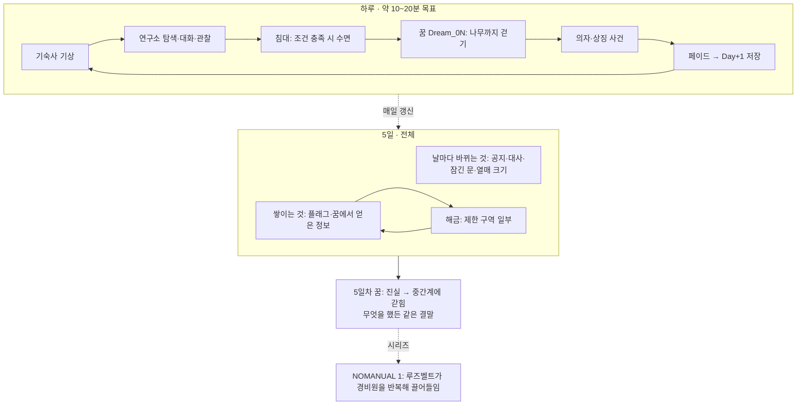

# 종합: NOMANUAL 0의 게임 사이클과 핵심 시스템

> - 작성 2026-09-16, 지휘실(roosevelt-d1). 세 세션 분석을 합치고 개발 루트 코드와 대조함
> - 근거 문서(같은 폴더)
>   - `레퍼런스_유사작_지형도.md`: 유사작 11편 비교, 포지션 (roosevelt-98)
>   - `역기획서_날짜사이클_꿈현실순환.md`: 날짜 사이클·꿈↔현실·제한 구역 해금 (roosevelt-bf)
>   - `역기획서_NOMANUAL1_근무사이클_고정비극.md`: 1편 근무 사이클, 고정 결말 서사 (roosevelt-d1)
> - 기획 기준: `../01_기획/0일차_기획.md`, `../02_세계관/세계관_리좀솔루션.md`. 여기 적힌 [제안]은 확정이 아니다

## 1. 한 문단 요약

NOMANUAL 0은 **"결말은 이미 정해져 있고, 플레이어는 5일 동안 그 결말에 어떻게 손을 보태게 되는지 알아 가는"** 1인칭 호러다. 조사한 11편 중 "짧음 + 대화 + 현실/꿈 두 공간 + 처음부터 정해진 비극"을 한꺼번에 가진 작품은 없었다. 뼈대는 1편에서 물려받은 **고정 박자의 하루 반복**, 날마다 쌓이는 **플래그**, 그 플래그를 읽는 **꿈**, 그리고 그 모든 것을 배신하는 **고정 엔딩**이다.

## 2. 게임 사이클 (세 겹)

| 겹 | 반복 단위 | 플레이어가 하는 일 | 긴장의 원천 | 레퍼런스 |
|---|---|---|---|---|
| 하루 | 기상 → 탐색 → 수면 → 꿈 → 저장 | 어제와 다른 점 찾기, 대화, 금지 구역 엿보기 | **고정된 박자가 어긋나는 순간** | NOMANUAL 1(0~4시·4보고), The Exit 8 |
| 5일 | Day 0~5 | 플래그를 모아 진실 조각을 맞춤 | 열매가 자라는 날짜 제한, 친절한 NPC의 말 뒤집힘 | Majora's Mask(남은 날), Pathologic 2(날마다 악화) |
| 시리즈 | 0편 → 1편 | 0편의 결말이 1편의 원인이 됨 | "이 사람이 1편의 그 루즈벨트가 된다"를 아는 플레이어 | Mouthwashing(결말 먼저), 1편의 시간 되감기 |

**세 문서가 모두 같은 결론:** 결말은 숨기지 말고 먼저 암시한다(Mouthwashing 방식). 0일차 꿈의 의자 3개가 이미 그 역할을 하고 있다. 1~5일차는 "무슨 일이 일어날까"가 아니라 **"어떻게 그렇게 됐나, 나는 무엇을 보탰나"**를 묻는다.

## 3. 핵심 시스템과 현재 코드 상태

코드 대조(2026-09-16, `Roosevelt/Assets/Scripts`). roosevelt-bf 문서는 코드를 보지 않고 썼으므로 일부 제안은 이미 구현돼 있다.

| 시스템 | 역할 | 레퍼런스 | 지금 코드 | 남은 일 |
|---|---|---|---|---|
| 날짜·진행 | Day 0~5, 저장 | Majora's Mask, 1편 5일 | `GameState.Day`·`AdvanceDay`·`SaveSystem` | Day 2~5 콘텐츠 |
| 플래그 | 모든 진행 조건 | Persona/Pathologic식 명시 조건 | `GameState` 플래그, `GameFlags`에 2개 | 날짜별 플래그 설계표 |
| 소지품 | 꿈에서 얻은 것 | Yume Nikki 이펙트, 1편 기름·편지 | **`GameState.items` 있음**(인벤토리 UI 없음), `GameItems`는 비어 있음 | bf의 "아이템을 플래그로 대체" 제안은 필요 없음. UI 없는 items를 그대로 쓰면 된다 |
| 날짜별 공간 변화 | 같은 Reality 씬에서 차이만 켜고 끔 | The Exit 8, 1편 메일 수위 | **`ConditionalObject`**(Day 범위·플래그·아이템 AND) | 날마다 바뀌는 오브젝트 배치 |
| 제한 구역 | 쟁취할 영역 | Signalis/RE 등급, Observation 관찰 | **`TransitionDoor.requiredFlag` 있음**(bf의 "requiredFlags로 확장" 제안은 단일 플래그로 이미 됨), `LabDoor.locked` | 어떤 플래그가 어떤 문을 여는지 결정(9장 미정) |
| 대화 | 정보 전달, 친절의 뒤집힘 | 1편 R.S 메일, Mouthwashing | `DialogueData` 노드·선택지 `requiredFlag`/`setFlag` | 날짜별 대사 |
| 꿈 | 현실 행동을 읽어 상징으로 돌려줌 | LSD(전날→꿈), Silent Hill 이계 | `Dream_00`, `GameFlow.EnterDream` | **DreamContext는 코드에 없음.** 꿈 씬이 `GameState`를 직접 읽고 `ConditionalObject`로 분기하면 별도 구조 없이 된다 |
| 읽기 전용 텍스트 채널 | 날짜 차이를 싸게 만듦 | 1편 PC 메일, Signalis 로그 | 없음 | 게시판·연구 일지 단말 1종 [제안] |
| 날짜 표제 | 결말을 드리우는 캡션 | Mouthwashing 표제 카드 | "Day 1" 캡션 있음 | 날마다 다른 문구 |

## 4. 세 문서 사이의 충돌과 정리

- **"Pathologic 2의 하루 단위 압박감을 가져오자"(98) vs "실시간 압박은 배제"(bf).** 둘 다 맞다. 가져올 것은 시계가 아니라 **날마다 악화되는 체감**이다. 수단은 열매 크기, 공지 문구, 닫히는 문. 타이머·자원 게이지는 넣지 않는다(기획 6장)
- **"DayPhase(아침/자유/밤) 추가"(bf).** 지금 하루는 "기상 → 수면" 두 지점뿐이고 사이의 진행은 플래그로 충분하다. 한 날 안에서 NPC 위치가 시간대별로 바뀌어야 할 때만 추가한다. 보류 권장
- **"unease 수치로 꿈 연출 분기"(bf).** 숨은 수치는 엔딩 1종인 게임에서 플레이어가 체감할 경로가 없다. 먼저 플래그로 꿈 분기 2~3개를 만들고, 부족할 때 도입한다. 보류 권장
- **"규칙서 암기형 튜토리얼은 피하자"(98) vs 1편 규칙서 거울 구조(d1).** 충돌 아님. 규칙을 외우게 하는 게 아니라, **"보호 조치"라는 설명 뒤에 숨은 의도**를 뒤집는 구조만 가져온다
- **Mouthwashing 표제 문구 예시.** bf 문서의 "추락 0일 전", "심판까지 1시간" 등 표제 문구는 출처 대조를 못 했다 `[추정]`. 3개 시간대 교차 구조 자체는 d1 문서에서 두 출처로 확인했다

## 5. 제안하는 결정 (사용자 확인 필요)

| # | 결정할 것 | 권장안 | 근거 |
|---|---|---|---|
| 1 | 고정 엔딩 수용 방식 | 결말 선제 암시(의자 3개, 날마다 커지는 열매) + **좋은 뜻의 행동이 의식을 도운 것으로 드러남** | d1 7.2, bf 1.3, 98 가져올 것 1. 루즈벨트가 훗날 가해자가 되는 동기와 이어짐 |
| 2 | 제한 구역 해금 | 문마다 섞음: 관찰로 여는 문 + 꿈 단서로 여는 문. 둘 다 `TransitionDoor.requiredFlag`로 구현 | bf 3.3. 단서 없이 막는 Exit 8식은 피함 |
| 3 | 꿈에서 가져오는 것 | 실물보다 **정보**(현실에서 NPC에게 물을 수 있는 단어·장소). 필요하면 UI 없는 `items` | bf 2.5, 기획 6장(인벤토리 제외) |
| 4 | 날짜 차이 전달 채널 | 게시판·연구 일지 같은 읽기 전용 채널 1종 추가 | d1 7.4, 98 가져올 것 3(Signalis 로그). 맵 추가보다 쌈 |
| 5 | 1편 정사 보호 | 플레이어는 끝까지 의식을 막을 수단을 갖지 못한다. 5일차는 "가족과 함께라고 믿는 중간계"의 시작까지만 | 1편 대사 "지켜볼 수밖에 없었죠", 1편 햇살 속 집 엔딩 |
| 6 | 놓친 진실 조각 | 5일차 꿈에서 짧게 회수하는 장면 | 1편의 숨은 분기 때문에 None 엔딩만 보는 문제 반복 방지 |

## 6. 확인 못 한 것

- NOMANUAL 1 완주 분량, 정신력·스태미나 수치와 실패 조건(스토어 설명에만 있음)
- Roosevelt 전체 플레이 길이 목표(기획 문서에 없음). 0일차 MVP만 20~30분 `[추정]`
- 기타 작품별 [미확인]은 각 근거 문서 끝에 있음
